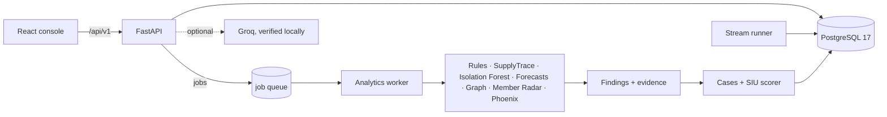

# ClaimShield Nexus

**From suspicious claims to defensible investigations** · Team CIPHER · Build to Care hackathon

ClaimShield Nexus is a local investigation platform for healthcare payment integrity.

- **Detection:** it screens claims with deterministic rules, item-level supply analysis, machine learning, relationship graphs and new-member and successor-provider detectors.
- **Cases:** it fuses their source-linked findings into ranked investigation cases.
- **Investigation:** it helps an investigator decide what evidence to get next, record reviewed decisions, and recommend actions under an explicit policy, with a full audit trail.
- **Live stream:** a live mode streams synthetic claims through the whole pipeline in real time.

> **Synthetic data only.** Every patient, provider, facility and claim is synthetic. Findings are screening indicators for human review. They do not establish fraud, intent, clinical necessity or recoverable overpayment. Review exposure is an upper bound, not a loss estimate. Authentication is a labeled demo identity, not a production login.

---

## Contents

[Features](#features) · [Quick start](#quick-start) · [Using the app](#using-the-app) · [Architecture](#architecture) · [Results](#results) · [Testing](#testing) · [Configuration](#configuration) · [Project structure](#project-structure) · [Documentation](#documentation) · [Troubleshooting](#troubleshooting) · [Limitations](#limitations)

---

## Features

### Detection engines
| Engine | What it finds |
|---|---|
| **Claim Rules** | Duplicate submissions, missing encounters, upcoding, unbundling, early refills, overlapping appointments, excessive utilization (gated by a synthetic billing-policy catalog) |
| **SupplyTrace** | Itemized consumable quantity and unit-price outliers against matched peers (same procedure, complexity and supply code), duplicate supply lines, estimate-to-final drift |
| **Isolation Forest** | Provider behavior anomalies from time-consistent features, reported as a percentile, not a probability |
| **30/60/90-day forecasts** | Recurrence of observable billing events (HistGradientBoosting with a logistic benchmark, trained and tested in time order) |
| **Nexus graph** | Provider, facility, owner, member and claim relationships; referral concentration corroborated by independent findings |
| **Member Radar** | Providers that suddenly bill many previously unrelated members; member risk signals scored with robust (median-based) statistics |
| **Phoenix detector** | Possible successors of suspended, revoked or closed providers, scored as a five-component similarity (not a probability) |

### Investigation
- **Cases and SIU queue:** findings are consolidated into cases, which the existing SIU scorer (`siu-1.0`) ranks. The score combines severity, evidence, unique-claim exposure, member impact, recurrence and the number of independent detection engines. A capacity slider limits the queue to what the team can handle.
- **Case Workspace:** findings, evidence records, claims, timeline, finding review (explain, keep unresolved or escalate against verified records) and investigator actions.
- **Next-Best-Evidence:** the evidence requests most likely to change the review decision, with read-only "what-if" simulations scored by the production scorer, plus a full evidence-request lifecycle.
- **Member confirmations:** simulated member notices (no one is ever contacted); responses count only after investigator review. **Spillover** shows a member batch's other claims as leads.
- **Compliance & decisions:** an internal demo policy, `CLAIMSHIELD-SIU-V1`, evaluates four actions:
  - Request more evidence
  - Monitor provider
  - Recommend full investigation
  - Recommend external referral

  Each action gets a status: Allowed, Needs Evidence, Requires Approval or Blocked. The status comes from reviewed evidence, never from the priority score. Recommendations are enforced on the server and audited. The SIU queue shows each case's **Decision readiness**.
- **AI briefs (optional):** Groq generates a brief, an evidence challenger or an evidence investigator report. Each fact is checked locally against the source records, and the app falls back to a deterministic report without a key.

### Live Claims Monitoring
Start a session from the dashboard: 90 synthetic claims at one per second. Each claim goes through two layers:
- **Immediately:** it is validated, saved, and screened by Claim Rules and SupplyTrace, and any findings update cases and rankings.
- **Background micro-batches:** the existing worker runs the stored ML models, the graph, Member Radar and Phoenix, scoped to the affected providers and members.

Every claim's 12 processing stages are tracked, and a claim is marked *Fully analyzed* only when all of them have finished. The event feed shows only committed database events, and each event links to its claim, case or provider.

---

## Quick start

**Requirements:** Windows 10/11 with WSL2 and Docker Desktop (Linux containers), and Git. Host Python and Node are not needed.

```powershell
git clone https://github.com/rayyandeys/ClaimShield-Nexus.git
cd ClaimShield-Nexus
Copy-Item .env.example .env
docker compose up --build -d

# Import data, train models, analyze (a few minutes)
docker compose exec backend python -m app.cli all
# Add the investigation scenario pack, then re-analyze
docker compose exec backend python -m app.cli augment
docker compose exec backend python -m app.cli analyze
```

Open **http://localhost:5173**.

| Service | Address |
|---|---|
| Investigator console | http://localhost:5173 |
| API / OpenAPI docs | http://localhost:8000 · http://localhost:8000/docs |
| PostgreSQL | 127.0.0.1:55432 (user `claimshield`) |

When setup is complete, the database holds **21,151 claims, 1,599 findings and 898 cases**, all five services report `healthy` in `docker compose ps`, and P0252 tops the SIU queue at priority 86.7.

Day-to-day commands:

```powershell
docker compose up -d        # start
docker compose ps           # status
docker compose logs --tail 100 worker
docker compose stop         # stop (keeps data)
```

Never run `docker compose down -v`: it deletes the database, including every investigator decision.

To set up a second machine, see **[SETUP_NEW_MACHINE.md](SETUP_NEW_MACHINE.md)**. It is written for an AI agent, and includes copying an existing database.

---

## Using the app

| Screen | Route | Highlights |
|---|---|---|
| Dashboard | `/` | Totals, the **Live Claims Monitor** (collapsible; Start/Stop), claims trend, case severity, top investigations, system status |
| SIU queue | `/queue` | Ranked cases, capacity, decision readiness, evidence that could change the queue |
| Case Workspace | `/cases/:id` | Tabs: Findings · Next evidence · Requests · **Compliance & decisions** · Confirmations · Spillover · Evidence · Claims · Brief · Timeline |
| Claims / SupplyTrace | `/claims`, `/supplytrace` | Search the ledger; claim detail with lines, encounter, findings; supply peer comparison |
| Nexus network | `/network?entity=` | Interactive graph with filters, an as-of date and a Phoenix edge inspector |
| Member radar | `/radar` | New-member batches, threshold checks, provider–member graph, member signals |
| Future risk | `/forecast?provider=` | 30/60/90-day forecasts and anomaly percentile |
| Data ingestion | `/ingestion` | Import, validate and analyze; upload a CSV snapshot; job queue |
| Models & evaluation | `/evaluation` | Model cards, held-out metrics, scenario evaluation |

**Demo cases** (from the scenario pack):
- **`CASE-27cd5d9b606a132d854e` (P0252):** a suspicious new-member batch plus a possible successor of the revoked P0251 (similarity 0.82).
- **`CASE-a2bd7630032dd71dfa4d` (P0258):** a look-alike successor that a documented acquisition explains.
- **P0259:** a legitimate fast-growing practice that is not flagged.

Walkthroughs: [main demo](docs/demo_script.md) · [live stream demo](docs/LIVE_STREAM_DEMO.md) · [every screen explained](docs/SCREEN_GUIDE.md).

---

## Architecture



Five Docker services: `db`, `backend`, `worker`, `stream` and `frontend`.

- **Single source of truth:** PostgreSQL holds the source tables, findings, cases, the job queue, stream state and an append-only audit trail.
- **Shared contracts:** every path that creates findings uses one finding and evidence format, and every ranking uses the same SIU scorer.
- **Safe re-runs:** IDs derived from content make re-analysis and retries idempotent, and reviewer decisions are never overwritten.
- **Concurrency:** advisory locks and leases (`SKIP LOCKED`) keep concurrent processing safe.

**Stack:**
- **Backend:** Python 3.12, FastAPI, Pydantic v2, SQLAlchemy 2 Core, Alembic, psycopg 3.
- **Analytics:** pandas, NumPy, SciPy, scikit-learn, NetworkX, Groq SDK.
- **Frontend:** React 19, TypeScript, Vite, TanStack Query and Table, React Router, ECharts, Cytoscape.js, Lucide, Tailwind v4.
- **Tests:** pytest and Vitest.

Full details: **[docs/architecture.md](docs/architecture.md)**.

---

## Results

All results are measured on synthetic data with injected patterns. They describe this prototype, not real-world fraud detection performance.

| Measure | Result |
|---|---|
| Held-out Precision@100 claims: rules only / + ML / + graph + SupplyTrace | **0.39 / 0.59 / 0.92** |
| Forecast test PR-AUC, 30 / 60 / 90 days | ≈ 0.07 / 0.15 / 0.21 |
| Scenario pack (Member Radar and Phoenix) | 6/6 scenarios agree, no unexpected flags |
| Live stream (60 claims at 1/s, local Docker) | 60/60 fully analyzed, 0 failed; end-to-end latency mean 11.2 s, p95 18.0 s; micro-batch ≈ 3.6 s; dashboard API ≈ 48 ms median during the stream |

Raw reports are in `artifacts/evaluation/`.

---

## Testing

```powershell
# Everything: backend unit, feature/policy/stream integration, frontend
powershell -ExecutionPolicy Bypass -File .\scripts\test.ps1

# Read-only smoke test against the running API
docker compose exec backend python -m app.smoke

# Measured live-stream session (writes: starts a real session)
docker compose exec backend python -m app.stream_measure --claims 60 --rate 1
```

| Suite | Latest result |
|---|---|
| Backend (unit and review workflow, `claimshield_test`) | 122 passed |
| Integration (features, policy, live stream, disposable `claimshield_features_test`) | 32 passed |
| Frontend (Vitest) | all passing (28 tests) |
| TypeScript / production build | pass |

The test script uses its own databases and never touches the demo database. Details: [docs/testing.md](docs/testing.md).

---

## Configuration

`.env` (copy `.env.example`; never commit it):

| Variable | Default | Purpose |
|---|---|---|
| `POSTGRES_PASSWORD` | `claimshield_local_demo` | Local database password |
| `GROQ_API_KEY` | empty | Optional; enables AI briefs. A Windows user environment variable of the same name takes precedence. |
| `GROQ_MODEL` / `GROQ_TIMEOUT_SECONDS` | `openai/gpt-oss-120b` / `45` | Groq model and timeout |
| `STREAM_DEFAULT_RATE` / `STREAM_DEFAULT_COUNT` | `1` / `60` | API defaults; the dashboard always starts 90 claims at 1/s |
| `STREAM_ENRICHMENT_INTERVAL_SECONDS` | `15` | Background micro-batch interval |
| `STREAM_MAX_BACKLOG` | `20` | Generation pauses above this screening backlog |

After setting a Groq key, run:

```powershell
docker compose up -d --force-recreate backend worker
docker compose exec backend python -m app.cli groq-check
```

Each AI report is a billable Groq call. Keys never reach the frontend or API responses, and only a bounded synthetic evidence snapshot is sent.

**CLI** (`docker compose exec backend python -m app.cli <command>`):

| Command | What it does |
|---|---|
| `audit` | Validate the CSVs only |
| `import` | Import the CSVs |
| `analyze` | Full analysis |
| `train` | Train the models |
| `all` | Import, train and analyze |
| `augment` | Add the scenario pack |
| `groq-check` | Check the Groq connection |

**Rebuilding images:** `backend`, `worker` and `stream` are separate images built from `./backend`. After backend changes, run `docker compose build backend worker stream`.

---

## Project structure

```
backend/
  alembic/versions/        migrations 0001–0004 (additive only)
  app/
    main.py                REST API (/api/v1)
    models.py, schemas.py  tables and contracts
    worker.py              persistent job queue (import, analysis, stream enrichment)
    stream_runner.py       live-stream runner
    cli.py, scenarios.py   commands and scenario pack
    config/                detector thresholds, evidence catalog
    services/              ingestion · detection · ml · graph · radar · phoenix · cases · evidence ·
                           briefs · pipeline · stream · stream_generator · policy · repository
  tests/                   unit and integration suites
frontend/src/
  App.tsx, api.ts, types.ts, theme.css
  pages/                   System (dashboard) · LiveMonitor · Cases · Investigation · Compliance ·
                           Claims · Intelligence · Radar
  *.test.tsx               Vitest suites
data/synthetic/            12 source CSVs (read-only); data/evaluation/ holds offline labels only
artifacts/                 models (generated), evaluation reports
docs/                      architecture, guides, demos, model cards
scripts/test.ps1           full test run
```

### Source dataset

The source dataset has:
- 4,000 members, 250 providers and 60 facilities
- 20,000 claims with 27,221 lines, 7,081 supply items and 1,850 estimates
- 19,705 encounters, 2,000 referrals and 410 relationships
- 150 investigation histories and 10 synthetic billing policies

Service dates span 2024-10-01 to 2026-09-30.

The scenario pack appends 14 providers and 1,151 claims, along with their encounters, referrals and profiles. Evaluation labels (`data/evaluation/ground_truth.csv`) are used only for offline evaluation and never by detectors.

---

## Documentation

| Document | Contents |
|---|---|
| [docs/architecture.md](docs/architecture.md) | Complete system architecture |
| [docs/SCREEN_GUIDE.md](docs/SCREEN_GUIDE.md) | Every screen and section, where Groq is used, where each engine can be demonstrated |
| [docs/demo_script.md](docs/demo_script.md) | Main investigation demo (Member Radar → Phoenix → case → Next-Best-Evidence → confirmations → decisions) |
| [docs/LIVE_STREAM_DEMO.md](docs/LIVE_STREAM_DEMO.md) | Live stream demo walkthrough |
| [docs/LIVE_CLAIMS_MONITORING.md](docs/LIVE_CLAIMS_MONITORING.md) | Live monitoring design, coverage semantics, measured performance |
| [docs/POLICY_DECISIONS.md](docs/POLICY_DECISIONS.md) | Policy rules, recommendations and approvals |
| [docs/investigation_extensions.md](docs/investigation_extensions.md) | Next-Best-Evidence, Member Radar and Phoenix algorithms and thresholds |
| [docs/model_cards.md](docs/model_cards.md) · [docs/data_dictionary.md](docs/data_dictionary.md) · [docs/api_contracts.md](docs/api_contracts.md) | Models, data, API |
| [docs/testing.md](docs/testing.md) | Test suites |
| [docs/IMPLEMENTATION_SUMMARY.md](docs/IMPLEMENTATION_SUMMARY.md) | What has been built |
| [SETUP_NEW_MACHINE.md](SETUP_NEW_MACHINE.md) | Reproduce the project on another laptop |

---

## Troubleshooting

| Symptom | Fix |
|---|---|
| `docker version` shows no Server | Start Docker Desktop (WSL2 / Linux containers) |
| Build fails with a registry or TLS timeout | Network issue; re-run the build |
| Empty dashboard | Run the data commands in [Quick start](#quick-start) |
| *Stream runner offline* | `docker compose up -d stream`; then `docker compose logs --tail 100 stream` |
| Stream claims never reach *Fully analyzed* | Check the `worker` service; rebuild with `docker compose build backend worker stream` |
| Briefs show *DETERMINISTIC* | No Groq key or Groq unavailable; expected offline |
| Rejected import | See *Data ingestion → Validation issues* and `artifacts/evaluation/latest_audit.json` |
| Port conflict | Free ports 5173, 8000 and 55432 |

---

## Limitations

- **Identity:** no authentication or roles. Policy approvals therefore remain pending by design.
- **Unvalidated heuristics:** thresholds, weights and the decision policy are internal demo choices on synthetic data, not CMS, HIPAA or any other official rules.
- **Cold-start anomalies:** Isolation Forest treats a brand-new provider's volume ramp as anomalous.
- **Scale:** single-node snapshot analytics sized for about 20k claims.
- **Replay stream:** the live stream replays past service dates; it is a demonstration feed, not a prospective real-time integration.
- **Audit immutability:** enforced against the application, not against a database administrator.
