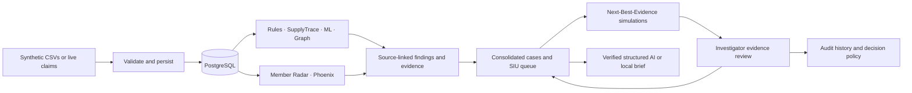

# ClaimShield Nexus

### Find the pattern. Choose the next evidence. Build a defensible case.

**Team CIPHER · Healthcare payment-integrity investigation prototype**

ClaimShield Nexus is an end-to-end healthcare Fraud, Waste and Abuse (FWA) investigation prototype for Special Investigation Units (SIU). It combines validated data ingestion, claim screening, itemized supply analysis, provider anomaly detection, future-event forecasts, relationship exploration, investigation prioritization, AI assistance and human review in one connected application.

Its three flagship capabilities—**Member Radar, Phoenix Provider Detector and Next-Best-Evidence**—extend that foundation: identify potentially compromised member activity, investigate possible successor providers, and choose evidence that could change a review decision.

**Platform workflow:** ingest → validate → detect → connect → forecast → consolidate → prioritize → investigate → review → reassess → audit.

[Flagship features](#how-the-three-features-work) · [Complete platform](#complete-platform-capabilities) · [Live processing](#live-claims-through-the-actual-engines) · [Evaluation](#measured-internal-evaluation) · [Quick start](#quick-start) · [Feature-to-code-and-test map](docs/FEATURE_EVIDENCE_MAP.md)

**Three connected investigation features:**

| Feature | Investigator's question | What happens in the product |
|---|---|---|
| **Member Radar** | Why is this provider suddenly billing so many previously unrelated members? | Detect a suspicious batch, inspect each member's signals, and record reviewed simulated confirmations. |
| **Phoenix Provider Detector** | Could this new provider be continuing a closed or sanctioned operation? | Compare five measurable signals, inspect a possible successor link, and investigate legitimate explanations such as an acquisition. |
| **Next-Best-Evidence** | What should I verify next with limited investigation capacity? | Preview how evidence could explain or strengthen a finding, change its priority, and move the case across the review cutoff. |

These workflows share the same source evidence, case workspace, ranking system and audit trail.


*Recorded local demo: 90 synthetic claims shown as fully analyzed. Counts and rates reflect that session, not a general throughput guarantee.*

> All records and member confirmations are synthetic. Findings are leads for human review. This prototype does not establish fraud or confirmed losses, and uses a labeled demo identity rather than production authentication.

## Follow one investigation

1. **Spot the pattern.** Member Radar flags a provider with a sharp increase in members lacking prior relationships or care context.
2. **Connect the history.** Phoenix identifies a possible relationship to a previously revoked provider and shows the patient, identifier, billing, referral and timing comparisons.
3. **Choose the next step.** Next-Best-Evidence compares applicable requests by expected priority change, review-capacity impact and estimated turnaround.
4. **Preview the consequence.** Simulate an explanation without saving any changes. See which cases would enter or leave the available review slots.
5. **Review the evidence.** Record an investigator-reviewed outcome. The case is recalculated and a source-linked evidence record and audit events are added.
6. **Check decision readiness.** A separate policy evaluates whether an action needs evidence or approval. A high priority score alone cannot authorize an external referral.

The supplied scenario pack supports this story around **P0252**, with additional examples for a subtle successor, an address-only look-alike, a legitimate practice closure, and a documented acquisition. [Demo walkthrough](docs/demo_script.md)

## How the three features work

### Next-Best-Evidence: prioritize the next investigation step

For each applicable evidence request, the system simulates an outcome that explains the finding and an outcome that supports it. Both use the **same scorer used to recalculate real cases**. It estimates the size of the priority change and the chance of crossing the top-K review boundary, then accounts for estimated turnaround time.

- Read-only simulations leave the saved case unchanged.
- Reviewed outcomes can lower or strengthen a case's priority.
- Probability estimates are labeled synthetic defaults until enough reviewed outcomes exist; subsequent estimates use Beta smoothing.
- Requests move through requested, received, reviewed, inconclusive or withdrawn states.

[Implementation](backend/app/services/evidence.py) · [Workflow and read-only tests](backend/tests/test_features_integration.py)

### Member Radar: connect a provider-wide pattern to member evidence

The detector combines historical acquisition-rate checks with five member signals: first contacts, care-history mismatch, geographic change, missing encounters and duplicate services across providers. Median/MAD normalization puts the available member signals on a comparable scale.

- Required batch checks cover member count, growth, missing prior relationships and missing prior care context.
- Geography is corroborating context rather than a required trigger.
- A simulated response changes scoring only after investigator review.
- Three distinct reviewed member denials raise batch severity to HIGH. One member confirming a service can explain that member's allegation without clearing the whole batch.
- Other claims involving the batch's members are shown as spillover leads, separate from review exposure.

[Implementation](backend/app/services/radar.py) · [Confirmation workflow](backend/app/services/evidence.py) · [Methods and limits](docs/investigation_extensions.md)

### Phoenix: make a possible successor relationship inspectable

Phoenix compares eligible new providers with providers that were suspended, revoked or closed. It uses Jaccard similarity for patient and referral overlap, cosine similarity for billing-code counts, identifier matching, and time between closure and enrollment.

| Component | Weight |
|---|---:|
| Patient overlap | 35% |
| Shared operational identifiers | 25% |
| Billing-code similarity | 20% |
| Referral-source overlap | 15% |
| Timing | 5% |

A flag needs a total score of at least 0.55 plus multiple supporting components, including behavioral evidence. Missing identifiers never become matches. A dashed graph edge displays the result and its source records. Prior-provider allegations are not transferred to the successor.

These are explicit prototype heuristics. A similarity score is not a misconduct probability. A documented acquisition is surfaced as a possible explanation for review.

[Implementation](backend/app/services/phoenix.py) · [Versioned thresholds](backend/app/config/detectors.json)

## Complete platform capabilities

### 1. Dashboard and connected investigator console

The React console gives investigators dataset dates, claim counts, active findings, investigation counts, unique-claim review exposure, monthly activity, case severity, top-ranked investigations, model readiness and processing history. The embedded Live Claims Monitor connects new events to the relevant claim or investigation.

Global claim search, a keyboard search shortcut, a collapsible sidebar, filtered/paginated lists, loading/error/empty states and links between screens support the investigation workflow.

| Screen | What an investigator can inspect or do |
|---|---|
| Dashboard | Assess workload, view trends and readiness, open top investigations, run a synthetic live session |
| Claims | Search and filter claims; inspect line items, encounters, findings, source fields and related cases |
| SupplyTrace | Inspect itemized supply quantity and unit price against matched peers and compare estimates with final bills |
| Nexus network | Explore entities, recorded relationships and possible-successor links with date/type filters |
| Member Radar | Review batches, acquisition history, relationship checks, member signals and batch graphs |
| Future risk | Inspect provider anomalies, 30/60/90-day recurrence forecasts, input signals and limitations |
| SIU queue | Set review capacity, filter investigations, inspect ranking factors and decision readiness |
| Case Workspace | Review findings and evidence, request records, simulate outcomes, record reviews and inspect the timeline |
| Data ingestion | Import or upload a snapshot, inspect validation issues, queue analysis and follow processing jobs |
| Models & evaluation | Inspect model versions, metrics, benchmarks, calibration bins and scenario results |

[Screen guide](docs/SCREEN_GUIDE.md) · [Application routes](frontend/src/App.tsx)

### 2. Validated data ingestion and provenance

The importer handles **12 operational CSV tables** and two optional profile tables. It checks schema, types, required references, duplicate IDs, dates, claim-line totals, supply-line consistency and financial arithmetic before importing a snapshot transactionally. Missing encounter documentation is retained as a reviewable gap rather than silently fabricated.

- SHA-256 file checksums, batch records and source provenance make imports inspectable.
- Invalid snapshots are rejected with validation reports.
- Identical imports avoid duplicate records; conflicting changes under existing source IDs are rejected.
- UI upload accepts a complete CSV snapshot; local import and import-plus-analysis use the same durable worker workflow.
- Operational source data and hidden evaluation labels have separate roles; claim and case APIs do not expose the answer labels.

The original snapshot includes **20,000 claims, 4,000 members, 250 providers, 60 facilities, 27,221 claim lines and 7,081 supply items**. The scenario pack appends records for the flagship features while preserving the original snapshot.

[Importer](backend/app/services/ingestion.py) · [Data dictionary](docs/data_dictionary.md) · [Ingestion tests](backend/tests/test_ingestion.py)

### 3. Deterministic claim screening

The rule engine turns specific recorded inconsistencies into findings with evidence IDs, observed values, context, severity and limitations.

| Screening capability | Implemented check |
|---|---|
| Duplicate billing | Repeated member/provider/procedure/service-time submissions, with correction, replacement and excluded-status handling |
| Upcoding indicator | A billed higher-level synthetic consultation conflicts with the recorded lower-level, low-complexity encounter |
| Unbundling indicator | Base and component codes appear together under the imported synthetic package policy |
| Missing encounter | No linked encounter is available; the finding explicitly identifies missing documentation |
| Impossible timing | Recorded appointments for different members overlap for the same provider |
| Early refill | Recorded refill interval is less than half the preceding days supply |
| Excessive utilization | Rolling 30-day same-procedure activity exceeds a procedure/complexity peer threshold; small peer groups and high-complexity cases receive conservative handling |

Rules use the project's fictional billing-policy catalog. Clinical necessity, staffing explanations, adjustments and legitimate refill reasons remain investigator questions.

[Rule implementation](backend/app/services/detection.py) · [Rule and legitimate-context tests](backend/tests/test_detection.py)

### 4. SupplyTrace: item-level payment integrity

SupplyTrace adds a separate view of consumables that can be missed in a claim-total score. It compares the **same procedure, recorded complexity and supply code**, requires at least 20 peer observations for outlier decisions, and calculates medians and interquartile ranges.

- **Quantity outliers:** unusually many units of a matched item.
- **Unit-price outliers:** unusually high unit charges, independently of quantity.
- **Duplicate supply charges:** distinct records with matching item, quantity and price.
- **Estimate-to-final drift:** final billed amount more than 50% above the recorded estimate.
- **Review context:** peer counts, thresholds, comparison charts, plausible legitimate explanations and missing documentation such as item logs or operative notes.

Supply amounts already represented in claim lines are not added again to exposure. An estimate increase is a review signal, not an automatic finding of overpayment.

[Supply analysis](backend/app/services/detection.py) · [SupplyTrace screen](frontend/src/pages/Claims.tsx) · [Tests](backend/tests/test_detection.py)

### 5. Provider anomaly detection

A persisted **Isolation Forest** detects unusual provider behavior using claim volume, financial ratios, member/procedure counts, observed event rates, referral concentration and available investigation history. Amount features are normalized relative to specialty peers; scoring uses a historical reference distribution.

The UI reports an anomaly percentile and underlying signals. Features respect scoring cutoffs, including available payment and outcome information. Model artifacts and versions are retained for repeat scoring. A percentile describes unusualness; it is not a probability of fraud or a causal explanation.

[ML implementation](backend/app/services/ml.py) · [Temporal feature and model persistence tests](backend/tests/test_graph_cases_ml.py)

### 6. Forward-looking 30/60/90-day event recurrence

Three independently trained **HistGradientBoosting classifiers** estimate future recurrence of defined observable synthetic billing events. Each horizon has a LogisticRegression benchmark. Chronological train/validation/test periods and a 90-day embargo separate future label windows across splits.

Model cards expose sample counts, class counts, split dates, features, PR-AUC, ROC-AUC where defined, Brier scores, calibration bins and benchmark results. Inadequate data produces an explicit unavailable status. The application does not substitute a fabricated probability.

These forecasts support prioritization. They are not clinically validated fraud predictions, are not post-hoc calibrated, and need not increase monotonically across independently fitted horizons.

[Model cards](docs/model_cards.md) · [Forecast implementation](backend/app/services/ml.py) · [Integration checks](backend/tests/test_integration.py)

### 7. Nexus relationship intelligence

The NetworkX graph connects providers, facilities, owners, members, claims and referrals with original source record references. Referral concentration becomes a finding only when supported by independent endpoint findings. Recorded ownership connections remain contextual.

The Cytoscape explorer supports node/edge inspection, zoom and pan, entity-type and relationship filters, an as-of date and bounded graph views with truncation disclosure. Phoenix adds explicitly labeled algorithmic-similarity edges, distinguishable from recorded relationships. Provider banners connect graph results with cases, Radar and forecasts.

[Graph construction and finding logic](backend/app/services/graph.py) · [Network UI](frontend/src/pages/Intelligence.tsx) · [Graph tests](backend/tests/test_graph_cases_ml.py)

### 8. Case consolidation and transparent SIU prioritization

Shared-claim and provider-month findings are consolidated into investigations. Provider-level anomaly, member-batch and possible-successor findings about the same provider can join one case. The workspace keeps related claims, evidence and entities connected.

| Priority factor | Maximum contribution |
|---|---:|
| Severity | 30 |
| Evidence completeness proxy | 20 |
| Log-normalized unique-claim review exposure | 20 |
| Member impact | 10 |
| 90-day event recurrence | 10 |
| Corroboration across distinct engine channels | 10 |

The queue supports review capacity, filters and an inspectable factor breakdown. Distinct engine channels are an explicit scoring heuristic, not proof of statistical independence. Decision readiness is displayed separately from priority.

**Financial discipline:** billed, allowed, paid and member responsibility remain distinct. Review exposure counts unique active-flagged claims: paid amounts for paid claims and allowed amounts for pending claims. It is an upper bound for investigation, not confirmed loss or recoverable savings. Prepayment, postpayment and mixed case contexts are identified.

[Consolidation and shared scorer](backend/app/services/cases.py) · [Queue and case UI](frontend/src/pages/Cases.tsx) · [Unique-exposure tests](backend/tests/test_graph_cases_ml.py)

### 9. Human investigation, reassessment and audit history

Case Workspace combines findings, Next evidence, Requests, Compliance & decisions, Confirmations, Spillover, Evidence, Claims, Brief and Timeline views.

- Assign an investigator, add notes, request records and move through validated case states.
- Review a finding as explained, unresolved or escalated with a reason and verified evidence references.
- Preserve the original finding while recalculating priority and exposure after review.
- Maintain evidence versions and append audit events with actor, explanation, previous state and new state.
- Reject invalid transitions and evidence references on the server.
- Preserve reviewed outcomes in tested same-snapshot reanalysis and stream workflows.

PostgreSQL triggers enforce append-only audit events through ordinary database operations. This is a persistence control; it does not claim cryptographic protection against a privileged database administrator.

[Review service](backend/app/services/cases.py) · [Audit migration](backend/alembic/versions/0001_initial.py) · [Human review tests](backend/tests/test_integration.py)

### 10. Three AI assistance modes with source verification

Optional Groq integration supports three different investigation tasks:

| Mode | Purpose |
|---|---|
| Investigation brief | Summarize the strongest source facts and open questions |
| Evidence challenger | Propose plausible legitimate explanations and what would confirm or refute them |
| Evidence investigator | Identify facts needing verification and records to request |

The service retrieves bounded case evidence, requests a structured schema, and verifies proposed facts against local **evidence ID + field + value** records. It checks finding references and constrains narrative numbers. Unverifiable items are filtered; unusable responses trigger a deterministic source-linked fallback. Factual narrative and financial sections are assembled locally.

Timeouts, bounded retries, caching and failure categories support predictable operation. Keys stay server-side. The model cannot execute SQL, resolve findings or change case state. Controlled tests exercise invented evidence, mismatched values, malformed responses, rate limits and timeouts. Live provider success depends on an available key and service.

[AI service](backend/app/services/briefs.py) · [Verification tests](backend/tests/test_briefs.py) · [Controlled integration tests](backend/tests/test_integration.py)

### 11. Policy-governed decisions

An internal versioned demonstration policy evaluates four actions: **request evidence, monitor provider, recommend full investigation, and recommend external referral**. Each gets an Allowed, Needs Evidence, Requires Approval or Blocked result with reasons.

Reviewed support is required for full-investigation eligibility. External referral additionally requires an investigation context, multiple reviewed supporting evidence records, applicable ownership/member evidence, justification and supervisor approval. Explained findings cannot support escalation, and closed cases block actions.

The server re-evaluates policy on submission and audits recommendations or blocks. Approval endpoints refuse while the application has only a demo identity; a typed name cannot substitute for an authenticated supervisor. This policy is a product demonstration, not a regulatory certification.

[Policy implementation](backend/app/services/policy.py) · [Policy specification](docs/POLICY_DECISIONS.md) · [Policy integration tests](backend/tests/test_policy_integration.py)

### 12. Persistent processing and reproducible operation

Docker Compose runs five services: PostgreSQL, FastAPI, the analytics worker, the stream runner and the React frontend. Database migrations run before API readiness; service health checks expose startup problems. The database uses a persistent volume, source CSVs are mounted read-only, and host-facing ports bind to loopback.

The PostgreSQL job queue tracks status, progress, attempts, results and errors. Workers claim jobs using `SKIP LOCKED`, renew leases with heartbeats, reclaim expired work after interruption and apply bounded retries. Dataset-processing operations prevent duplicate active jobs. Model/evaluation artifacts are stored locally.

The REST API has typed request/response contracts, pagination, explicit validation errors and OpenAPI documentation. Shared finding/evidence contracts retain source IDs, provenance, model/rule version, completeness and limitations across detection engines and the frontend.

[Compose services](docker-compose.yml) · [Worker](backend/app/worker.py) · [Contracts](docs/api_contracts.md) · [Schemas](backend/app/schemas.py)

## Live claims through the actual engines

Start a synthetic session from **Dashboard → Live Claims Monitor**. Claims are validated and committed to PostgreSQL, immediately screened by Claim Rules and SupplyTrace, then enriched in background micro-batches using stored ML models, the graph, Radar and Phoenix.

The inspector tracks **12 stages per claim** and distinguishes completed work, unavailable data, non-applicable stages and failures. Database-backed events link to the claim, finding, case or provider. A “fully analyzed” state requires the necessary processing stages to reach their defined terminal states; insufficient data is disclosed.

[Live workflow](docs/LIVE_CLAIMS_MONITORING.md) · [Integration tests](backend/tests/test_stream_integration.py)

Sessions support start/stop, prior-session inspection, event filters, claim-stage inspection and controlled retry of failed claims. Resumable event cursors and the SSE endpoint allow event consumption to continue from a known point. Session-specific cohorts isolate generated examples from the original investigation scenarios. Integration tests cover duplicate deliveries, review preservation, draining, interruption recovery and explicit failure states.

## Measured internal evaluation

On the same **7,394 held-out synthetic claims**, the recorded internal comparison reports:

| Detection stack | Labeled suspicious claims in top 100 | Other claims in top 100 |
|---|---:|---:|
| Rules | 39 | 61 |
| Rules + ML | 59 | 41 |
| Rules + ML + graph + SupplyTrace | **92** | **8** |

That is **Precision@100 of 0.39 → 0.59 → 0.92** in this retrospective synthetic evaluation. The full stack's top 100 captures about **15.3% of the 602 labeled suspicious held-out claims**. This is an internal baseline comparison, not overall accuracy or a benchmark against other products. Supply peers use snapshot statistics, so it is not a fully prospective replay.

The three investigation extensions have separate scenario and workflow checks; the 0.92 result is not evidence of their incremental detection benefit. Forecast results and limitations, including lack of post-hoc calibration, are reported separately.

[Evaluation JSON](artifacts/evaluation/evaluation_report.json) · [Scenario results](artifacts/evaluation/scenario_report.json) · [Model cards](docs/model_cards.md)

## Quick start

On the documented Windows setup, use Docker Desktop with Linux containers/WSL2 and Git. Host Python and Node are not required.

```powershell
git clone https://github.com/rayyandeys/ClaimShield-Nexus.git
cd ClaimShield-Nexus
Copy-Item .env.example .env
docker compose up --build -d
docker compose exec backend python -m app.cli all
docker compose exec backend python -m app.cli augment
docker compose exec backend python -m app.cli analyze
```

Open **http://localhost:5173**. API documentation is at **http://localhost:8000/docs**.

`all` imports the original snapshot and trains/analyzes it. `augment` adds the synthetic investigation scenarios; `analyze` includes them in findings and cases. Startup alone does not import the data. A Groq key is optional; configuration details are in the existing [technical README](README.md).

For later sessions, `docker compose up -d` starts services and `docker compose stop` stops them while retaining the database. Removing the database volume discards investigator decisions.

## Architecture



**Stack:** FastAPI, PostgreSQL, SQLAlchemy/Alembic, pandas/NumPy/scikit-learn, NetworkX, React/TypeScript, ECharts, Cytoscape and Docker Compose. The persistent worker uses leases, heartbeats and bounded retries. [Architecture details](docs/architecture.md)

## Verification you can inspect

The [complete feature evidence map](docs/FEATURE_EVIDENCE_MAP.md) connects each major capability to its screen, implementation and relevant tests. It is a navigation aid for human and automated code review, not an assertion of a score under an unpublished judging rubric.

| Evaluation area | Repository evidence |
|---|---|
| Problem coverage | Claim rules, SupplyTrace, anomaly detection, graph intelligence, forecasts, SIU prioritization and case review |
| Distinctive functionality | Next-Best-Evidence, Member Radar with confirmations, Phoenix successor detection |
| Integration | Common finding/evidence contracts, shared case scorer, linked UI routes and real live-processing path |
| Explainability | Source records, thresholds, score components, model cards and explicitly hypothetical alternative explanations |
| Data integrity | Transactional imports, checksums, validation, separate financial amounts and unique-claim exposure |
| Human oversight | Verified evidence references, state transitions, policy enforcement and audit events |
| Evaluation rigor | Internal baseline comparison, chronological splits, benchmark models and disclosed synthetic-data limits |
| Reproducibility | Docker Compose, migrations, seeded scenarios, persisted models and executable verification commands |

The repository includes tests for source validation, unique exposure, temporal model features, review preservation, read-only simulations, duplicate evidence requests, confirmation rules, legitimate look-alikes, stream recovery and decision-policy enforcement.

```powershell
# Isolated backend and investigation workflow suites
./scripts/test.ps1
# Frontend component tests
docker compose exec frontend npm test
# Read-only check of the running API
docker compose exec backend python -m app.smoke
```

The test script uses dedicated test databases, including a disposable feature-test database. See [testing details](docs/testing.md) for scope and recorded results. Test definitions and historical reports should not be mistaken for a fresh run on another machine.

## Prototype boundaries

The project has no production authentication, real member messaging, clinical record integration, automatic payment adjudication, or validated real-world fraud probabilities. The decision policy is an internal demonstration policy; external-referral approval remains pending because verified supervisor identities are not implemented. No regulatory certification is claimed.

Thresholds and weights are prototype choices. Constructed scenario success is not independent validation. Supply peers are retrospective, forecast snapshots within a split can overlap, and changed source populations require a stronger versioning strategy before production use. Source-linked evidence and human review help investigators assess these limits.

## Explore the project

[Three-feature algorithms](docs/investigation_extensions.md) · [Demo script](docs/demo_script.md) · [Decision policy](docs/POLICY_DECISIONS.md) · [Data dictionary](docs/data_dictionary.md) · [API contracts](docs/api_contracts.md) · [Machine setup](SETUP_NEW_MACHINE.md)

For a full-platform demonstration, open the dashboard and a SupplyTrace claim first; show the P0252 flagship investigation next; finish with the forecast/model card, AI challenger, policy readiness and audit timeline. This shows both platform breadth and the three distinctive workflows.