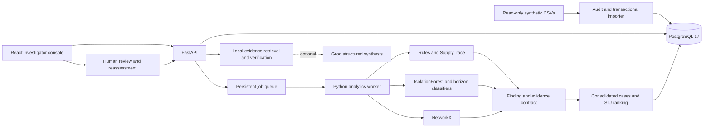

# ClaimShield Nexus

**From Suspicious Claims to Defensible Investigations** · Team CIPHER

A local healthcare payment-integrity investigation prototype. ClaimShield combines deterministic claim screening, procedure-matched consumable analysis, local machine learning, source-backed relationship graphs, and human case review. It helps an investigator identify questions worth pursuing and document decisions with evidence.

All patient, provider, facility and claim records are synthetic. Screening indicators do not establish fraud, intent, clinical necessity, or recoverable overpayments. This is a hackathon decision-support prototype with a labeled demo identity, not production authentication, regulatory certification or clinical validation.

## Start locally

Prerequisite: Windows 11 with Docker Desktop running Linux containers / WSL2. Host Python and Node are **not required**.

In PowerShell, from this directory:

```powershell
Copy-Item .env.example .env
# Optional: edit .env to set a local database password and a Groq key.
docker compose up --build -d
docker compose exec backend python -m app.cli all
```

The backend applies Alembic migrations automatically before becoming healthy. The second command imports the supplied CSV snapshot, trains models and runs the complete analysis pipeline. Alternatively, open **Data ingestion → Import & analyze** to run the same processing through the persistent worker queue.

| Service | Local address |
|---|---|
| Investigator console | http://localhost:5173 |
| API | http://localhost:8000 |
| OpenAPI documentation | http://localhost:8000/docs |
| PostgreSQL | 127.0.0.1:55432 |

Container communication uses `db:5432` and `backend:8000`. PostgreSQL uses the `claimshield-nexus_postgres_data` named volume. Source CSVs are mounted read-only; model and evaluation artifacts are written under `artifacts/`. Host ports bind only to the loopback interface.

For later runs:

```powershell
docker compose up -d
docker compose ps
docker compose logs --tail 100 worker
docker compose stop
```

Do not remove the database volume unless you intend to discard all imported data and investigator decisions.

## What is implemented

- Strict, transactional ingestion of all 12 operational CSVs, with checksums, source provenance, validation reports, repeat-import prevention and rejection of conflicting source IDs.
- PostgreSQL-backed worker jobs with safe `SKIP LOCKED` claiming, leases, heartbeat renewal, restart recovery and bounded retries.
- Duplicate submission, synthetic code mismatch, configured package unbundling, encounter gaps, provider appointment overlap, early refill and rolling utilization screening.
- SupplyTrace: procedure/complexity/item-matched median and IQR comparisons, quantity and price outliers, duplicate items, estimate-to-final drift, and source-linked synthetic bundling findings.
- A persisted IsolationForest pipeline with specialty-relative amount features and historical reference percentiles. Scores are not probabilities.
- Three independently trained HistGradientBoosting classifiers for 30/60/90-day observable-event recurrence, with LogisticRegression benchmarks, chronological train/validation/test periods and a 90-day embargo.
- NetworkX source graph, connected-component and degree statistics, shared ownership context, and referral concentration requiring independent endpoint findings. Cytoscape supports selection, zoom, pan, type/relationship filters and an as-of date.
- Stable finding/evidence identifiers, shared typed contracts, case consolidation, unique-claim review exposure and transparent capacity-aware ranking.
- Investigator assignments, notes, record requests, validated case-state transitions, finding resolutions and PostgreSQL-enforced append-only audit events.
- Groq evidence investigator, challenger and brief synthesis with strict JSON schema, exact local source-value verification, bounded output, timeout/retries, caching and offline fallback.
- Connected React screens for overview, ingestion, claims, SupplyTrace, network, forecasts, queue, case review and evaluation.

## Architecture and stack



Python 3.12, FastAPI, Pydantic v2/Settings, SQLAlchemy 2, Alembic, psycopg 3, HTTPX, pandas, NumPy, SciPy, scikit-learn, joblib, NetworkX, Groq SDK and pytest. The frontend uses React, TypeScript, Vite, Tailwind, a shadcn-style Radix/CVA button primitive, React Router, TanStack Query/Table, ECharts, Cytoscape, Lucide, React Hook Form, Zod and Vitest. There is no external database, message broker or hosted model inference for the trained models.

See [architecture](docs/architecture.md), [discovered source schemas](docs/data_dictionary.md), [model cards](docs/model_cards.md), [API contracts](docs/api_contracts.md), [testing](docs/testing.md) and [demo walkthrough](docs/demo_script.md).

## Source dataset

| Table | Actual rows |
|---|---:|
| members | 4,000 |
| providers | 250 |
| facilities | 60 |
| encounters | 19,705 |
| claims | 20,000 |
| claim_lines | 27,221 |
| supply_items | 7,081 |
| claim_estimates | 1,850 |
| referrals | 2,000 |
| relationships | 410 |
| investigation_history | 150 |
| billing_policies | 10 |
| ground_truth (evaluation only) | 20,000 |

Service dates span **2024-10-01 through 2026-09-30**. Source seed is `20261008`. The source archive, README and generation script were not present; the extracted CSVs and three metadata JSON files were present. Existing data is sufficient, so no replacement dataset was generated. Original files are preserved.

The original dataset has 130 empty encounter references and no populated correction references. Correction exceptions are exercised with automated synthetic test fixtures. The audit interprets naive source timestamps as UTC and reports contextual inconsistencies without fabricating documentation. `supply_items` describe amounts already included in `claim_lines`: they are never added twice.

`billed_amount_usd`, `allowed_amount_usd`, `paid_amount_usd`, and `member_responsibility_usd` remain distinct. The source contains a simplified synthetic payment model; the application validates its arithmetic and retains its amounts. Potential review exposure is the sum of unique active-flagged paid amounts plus pending allowed amounts. It is an upper bound for review, **not** a loss estimate or confirmed recoverable overpayment.

## Import and analysis commands

```powershell
docker compose exec backend python -m app.cli audit
docker compose exec backend python -m app.cli import
docker compose exec backend python -m app.cli analyze
docker compose exec backend python -m app.cli train
```

`analyze` and `train` run the integrated analytics pipeline, including refreshing model artifacts and case context. Use one operation at a time. The UI queues one active job, exposes persistent progress, and prevents duplicate submissions while a job runs. Repeated identical imports insert zero new records. A complete malformed snapshot is rejected transactionally; its batch report remains available. Uploads require all 12 operational CSVs with original names. The source snapshot is append-only: changed values under an existing ID are rejected rather than silently replacing evidence.

Operational APIs do not return hidden scenario labels. Only offline aggregate evaluation reads `data/evaluation/ground_truth.csv`.

## Methods and limits

Rules use the imported fictional policy catalog; no CMS/NCCI or real clinical compliance is claimed. Missing encounters are documentation gaps. Duplicate detection excludes both corrected claims and replaced originals. Timing uses recorded intervals and calls out possible staffing or timestamp errors. SupplyTrace compares the same procedure, recorded complexity and supply code, requires at least 20 peers, and uses Q3 + 3 × max(IQR, 10% of median, 0.01) as its upper threshold. An estimate increase above 50% is a review indicator, not a contractual violation.

Provider models use as-of features, known payment dates, historical investigation outcome-availability dates and specialty-relative amount statistics. Ground-truth labels are excluded from features. Forecast target: a provider with previous defined events has at least one further event, or a provider without prior events has at least two events, in the future horizon. Defined events are synthetic consultation-code mismatch, package conflict or early refill. Model quality and sample sizes are visible; probabilities are not post-hoc calibrated or forced to increase with horizon.

Cases connect shared-claim findings and provider-month groups; they do not merge every historical claim from a provider. Ranking weights: severity 30, completeness 20, log-normalized exposure 20, member impact 10, 90-day recurrence 10, and independent engine corroboration 10. Scoring is a prioritization policy, not a probability. Reviewer resolutions remove the active finding contribution, recalculate exposure without double counting, increment evidence version and preserve the original finding.

## Groq setup

Set these only in the local `.env` file:

```dotenv
GROQ_API_KEY=your_key_here
GROQ_MODEL=openai/gpt-oss-120b
GROQ_TIMEOUT_SECONDS=45
```

Then recreate backend and worker containers:

```powershell
docker compose up -d --force-recreate backend worker
docker compose exec backend python -m app.cli groq-check
```

The model ID is configurable, including `openai/gpt-oss-20b`. The explicit check calls Groq's model listing endpoint. Keys never go to the frontend or API responses. Only bounded synthetic case evidence is transmitted when generating a report. Core processing works offline after dependencies/images are downloaded.

The LLM selects exact evidence field/value facts and proposes explicitly hypothetical alternatives. All factual narrative and financial sections are composed locally. Unsupported evidence IDs, mismatched values, cross-finding references and unverified numeric prose reject the output. Verification does not prove clinical correctness or full factual completeness. The model cannot execute SQL, change a case or resolve a finding. SDK transient-error retries are bounded; malformed responses and provider failures return a deterministic source-linked report. See the official [Groq structured-output documentation](https://console.groq.com/docs/structured-outputs) used for this integration.

## Evaluation and tests

Machine-readable results live in `artifacts/evaluation/`; isolated test artifacts live in `artifacts/test-run/`. Model cards retain full feature lists, split dates, class counts, PR-AUC, ROC-AUC where defined, Brier score, calibration bins, Precision@K, Recall@K and logistic benchmarks.

The initial actual run produced 1,510 findings and 894 cases. On 7,394 held-out synthetic claims, Precision@100 was 0.39 for rules, 0.59 for rules + ML, and 0.92 for rules + ML + graph + SupplyTrace. Forecast test PR-AUC was approximately 0.070 / 0.145 / 0.214 for 30 / 60 / 90 days. These are synthetic retrospective results, not real-world fraud detection claims. See the generated reports for the latest values and limitations.

```powershell
# Unit suite
docker compose run --rm backend pytest -q -m "not integration"
# Complete isolated integration suite, including training and reassessment
./scripts/test.ps1
# Frontend component tests
docker compose exec frontend npm test
# Read-only live API smoke test
docker compose exec backend python -m app.smoke
```

## Troubleshooting

- Docker connection error: start Docker Desktop, select Linux containers, and verify `docker version` shows both client and server. Local automation may require permission to access the Docker named pipe.
- Port conflict: check 5173, 8000 and 55432 are free. No other project services need to be stopped.
- Empty console: run **Import & analyze** and inspect the Jobs table. Startup alone does not automatically import or train.
- Rejected import: inspect **Data ingestion → Validation issues** and `artifacts/evaluation/latest_audit.json`. Original input remains unchanged; conflicting source IDs require a separately versioned dataset rather than overwriting evidence.
- Worker failure: inspect `docker compose logs --tail 100 worker`. Expired running jobs can be reclaimed after their 90-second lease. Three attempts is the upper bound; validation errors fail immediately.
- Unavailable forecasts: inspect the model card. Every split needs both classes and a minimum sample count; no synthetic probabilities are substituted.
- Groq unavailable: the console displays a deterministic report and the reason category. Live Groq generation requires a valid configured key and provider access.

## Known prototype boundaries

No production authentication, clinical record system, real billing policy feed, real patient data, prospective validation or automatic adjudication is included. Shared-ownership analysis is contextual; connections never establish collusion. Supply peers are retrospective snapshot statistics, and forecast observations within a split can overlap. Upload is a complete CSV snapshot rather than an arbitrary schema mapper. Source records are immutable and analysis reruns are stable for the same snapshot; changing the source population can change consolidation boundaries and needs a versioned migration strategy before production use.

The existing source has no documented corrected claims. The demo resolves a narrow estimate-variance question using its existing estimate/final-line records while preserving other suspicious findings. Clinical necessity remains an open review question. Groq failure paths are tested with controlled mocks; a live response is only verified when a key is provided and an explicit live test succeeds.
# ClaimShield-Nexus

