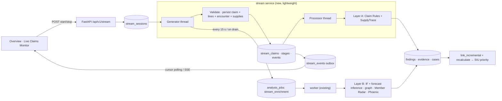

# Live Claims Monitoring

A backend-controlled synthetic claim stream that runs every accepted claim through the existing ClaimShield engines. Each claim is validated, persisted, screened at once, enriched in background micro-batches, linked to cases and ranked by the existing SIU scorer. The Overview screen shows only committed database state.

All records are synthetic. The stream never contacts anyone, never calls Groq automatically, never resolves findings and never accuses a provider.

---

## 1. Architecture

| Component | Where | Role |
|---|---|---|
| `app/services/stream_generator.py` | new | Scenario pack `live-stream-pack-v1`: deterministic cohort, arrival plan and source records |
| `app/services/stream.py` | new | Sessions, outbox events, Layer A, Layer B, coverage, metrics |
| `app/stream_runner.py` | new | Runner process: generator thread and processor thread |
| `app/worker.py` | extended | New job kind `stream_enrichment`, deduplicated separately from dataset jobs |
| `app/stream_measure.py` | new | Measured run against the live stack |

### How one claim moves through the pipeline

**Layer A: immediate, per claim, in the `stream` service**
1. *Generated.* The generator builds sequence *n* of the session plan deterministically.
2. *Validated.* The checks are the same row checks as snapshot ingestion (`claim_issues`, `supply_issues`, `estimate_issues` were extracted from the importer), plus reference checks against stored rows. A rejected claim emits `claim_rejected`, and nothing is persisted.
3. *Persisted.* The claim, its lines, encounter, supply items, `entities` row, `stream_claims` row, all 12 stage rows and the events are written in **one transaction**. The session counter advances only where `runner_id = me`, `status = RUNNING` and `generated_count = n-1`, so generation is exactly-once.
4. *Screened.* The processor leases the claim with `FOR UPDATE SKIP LOCKED`.
   - It runs the existing `rules()` on a scoped record set: duplicate candidates and corrections of them, the member's same-procedure claims in the 30-day window, the provider's appointments that day, lines, encounters and policies.
   - It runs the existing `supply_analysis()` on the claim's supply items plus the stored peer items for the same procedure, complexity and supply code.
   - Utilization thresholds come from the full claims history, cached for 10 minutes.
5. *Persisted and linked.* Findings are persisted with the shared idempotent `persist_findings`. `cases.link_incremental` creates or updates the case, and `recalculate` (existing scorer) reprices it. All of this happens in one transaction, under the same advisory lock the full analysis uses for case writes.

**Layer B: background micro-batch, an existing-worker job**
6. *Scheduled.* The runner enqueues `stream_enrichment` on the existing `analysis_jobs` queue: every 15 s while claims await enrichment, and immediately while a session drains.
7. *Engines run.* The run records exactly which claims it covers (`stream_enrichment_runs.claim_ids`, `watermark_sequence`). It loads the snapshot once (about 1 s) and runs each engine scoped to the covered claims' providers and members:
   - **Isolation Forest:** inference with the stored joblib pipeline at the model's scoring cutoff. No retraining.
   - **Forecast:** the 30/60/90 stored models, at their stored cutoff.
   - **Nexus graph:** neighborhood of each provider plus the referral-concentration rule, scoped.
   - **Member Radar:** provider candidates in scope. Member z-scores are normalized against the whole member population, and the dispersion peers are the stored candidates.
   - **Phoenix:** pairs where a scoped provider is the predecessor or the successor.
8. *Final reconciliation.* In one transaction: findings, predictions, radar rows and successor links are persisted; cases are linked; open cases of affected providers are recalculated, because the forecast feeds the scorer's recurrence factor; every covered claim's stages are set; and a claim becomes `FULLY_ANALYZED` only if all 12 stages are terminal.

---

## 2. Session lifecycle

`STARTING → RUNNING → (STOPPING) → DRAINING → COMPLETED | STOPPED` (`FAILED` is reserved for unrecoverable session errors).

| Action | Behavior |
|---|---|
| Start (`POST /stream/sessions`) | Validates the config and takes an advisory lock. Returns 409 if another session is active and 503 if no runner heartbeat in 20 s. Creates the session and a `stream` batch row. The partial unique index `uq_stream_one_active` guarantees at most one active session even under concurrent requests. |
| Activation | The runner takes the session lease, inserts the cohort (append-only) and sets `RUNNING`. |
| Generation | About `rate` claims/s, with backpressure (§6). |
| Stop (`POST …/stop`) | Sets `stop_requested` and `STOPPING` under the session row lock. Every later generation transaction fails its `status = RUNNING` condition, so no claim is generated after the stop is acknowledged. The response reports the generated count at acknowledgement. |
| Draining | No new claims. Accepted claims finish Layer A, and enrichment is scheduled immediately. |
| Completion | When every accepted claim is `FULLY_ANALYZED` or `FAILED` and no enrichment run is running. The final counts go to the session, its batch row and the `session_completed` event. |
| Runner restart | The lease (`runner_id`, `lease_until`, renewed every 5 s) expires after 30 s. A new runner takes over and continues from the persisted `generated_count`. Claims left in `PROCESSING` are re-leased after 60 s. |
| Worker restart | The existing job lease is reclaimed. A run left `RUNNING` is marked `INTERRUPTED`, and its claims are covered by the next run. |

Defaults are 60 claims at 1/s, seed `20261010`, mode `mixed_demo`, with at most 500 claims. Nothing starts at application startup.

---

## 3. Generator and scenario pack (`live-stream-pack-v1`)

**Cohort per session *k*** (prepared at activation, append-only):

| Role | Provider | Facility | Claims |
|---|---|---|---|
| A | `PS{k}A` Primary Care | F0028 (Seattle clinic) | Ordinary visits, duplicate submission, overlapping appointment |
| B | `PS{k}B` Surgery | F0011 (Seattle hospital) | Procedures with itemized supplies, quantity outlier |
| C | `PS{k}C` DME Supplier | F0058 (Seattle DME) | New-member burst (30 brand-new members `MS{k}nnn`) |

- **Providers:** each gets a provider row, an `affiliated_with` relationship, a provider profile (active, enrolled 2026-08-24) and an entity row.
- **Ordinary claims** go to *existing* synthetic members who already have a prior claim for the same code, so they have genuine care context. Members touched by any provider outside the original snapshot are excluded: scenario-pack members and earlier stream sessions. That leaves the scenario fixtures untouched, and no member is reused across sessions.

**Arrival plan (mixed demo, 60 claims).** The first 12 show every scenario:

| # | Scenario | Engine that decides |
|---|---|---|
| 1, 4, 10 | Ordinary visit (A) | Claim Rules: no finding |
| 2, 6, 9, 12 … | DME claim for a previously unseen member (C) | Member Radar, once ≥ 25 new members |
| 3, 7 | Procedure with ordinary supply quantities (B) | SupplyTrace: compared, no finding |
| 5 | Second submission of #1: same member, provider, date, code, start and encounter | Claim Rules `duplicate_billing` |
| 8 | Bandage quantity 160 (peer threshold ≈ 64) | SupplyTrace `consumable_quantity_anomaly` |
| 11 | Appointment starting 10 min into #10's appointment, different member | Claim Rules `impossible_timing` |
| 13–60 | 2 of every 3 claims continue the burst (30 total), the rest are ordinary A/B claims | — |

- **No faking:** no finding, score or ranking is hardcoded. The scenario label is stored for display only, and no engine reads it.
- **Dates:** service dates replay 2026-09-01 … 09-29, inside the dataset timeline and the synthetic billing-policy window, which ends 2026-09-30. Claims are `pending` (live intake). `generated_at` and `ingested_at` are real wall-clock times. Service dates stay at or before the models' scoring cutoff, and every streamed claim is after the training windows, so no future information leaks into training.
- **IDs:** claims `SC{k}-{seq}`, encounters `SE…`, lines `SL…`, supplies `SS…`. Session-specific, so replays never collide.

---

## 4. Full-coverage semantics

Twelve stages per claim are stored in `stream_claim_stages`: Validation, Persistence, Claim Rules, SupplyTrace, Isolation Forest, Nexus Graph, Member Radar, Phoenix, Forecast inference, Evidence fusion, Case consolidation, SIU ranking.

Statuses are `PENDING`, `RUNNING`, `RETRYING`, `COMPLETED`, `NOT_APPLICABLE`, `INSUFFICIENT_DATA` and `FAILED`.

| Stage | NOT_APPLICABLE / INSUFFICIENT_DATA contract |
|---|---|
| SupplyTrace | `NOT_APPLICABLE`: no supply items or estimates. `INSUFFICIENT_DATA`: every supply code has fewer than 20 matched peers. |
| Isolation Forest | `INSUFFICIENT_DATA`: the provider has fewer than 3 claims in the 90-day feature window. No score is invented. |
| Forecast | `INSUFFICIENT_DATA`: same eligibility rule. No prediction. |
| Phoenix | `NOT_APPLICABLE` only without a provider profile. Otherwise `COMPLETED`, either with the evaluated pairs or with an explicit "eligible, but no comparable pair yet" (a successor needs ≥ 5 claims within 90 days of enrollment) or "no qualifying predecessor". |
| Case consolidation / SIU ranking | `NOT_APPLICABLE`: no finding references the claim. Ordinary claims are not placed in cases. |
| Any engine error | `FAILED` / `RETRYING`, never `COMPLETED` or `NOT_APPLICABLE`. |

**Fully Analyzed** means all 12 stages are `COMPLETED`, `NOT_APPLICABLE` or `INSUFFICIENT_DATA`, and the claim's own enrichment run has committed its findings and case effects. A claim is never marked complete because an unrelated older run finished: each run reconciles only the claim IDs it recorded at its start.

**Investigator-only workflows** stay on demand: Next-Best-Evidence (recomputed on request from the committed case and queue), Groq briefs, member confirmations and human review.

---

## 5. Database changes (migration `0003`, additive only)

| Table | Purpose |
|---|---|
| `stream_sessions` | Config, seed, status, counters (`generated_count`, `rejected_count`, `max_backlog`), runner lease, cohort description, batch ID. Partial unique index `uq_stream_one_active`. |
| `stream_claims` | Claim ID, session, sequence (unique per session), scenario, `generated_at`, `ingested_at`, service date, analysis status, current stage, attempts, lease, enrichment run, finding and case IDs, error |
| `stream_claim_stages` | Per-claim, per-stage status, attempts, timestamps, finding count, reason, error, result (e.g. SupplyTrace peer comparisons), processing version |
| `stream_events` | Ordered processing events (outbox). Separate from the human `audit_events` trail. |
| `stream_enrichment_runs` | Covered claim IDs, watermark, providers, per-engine results and timings, duration |
| `stream_runners` | Runner heartbeats |

Streamed source rows go into the existing tables (`claims`, `claim_lines`, `encounters`, `supply_items`, `providers`, `members`, `relationships`, `provider_profiles`, `entities`), tagged `source_batch_id = STR-…` and `source_file = live_stream`.

**Protection of existing data and reviews**
- **Append-only.** Existing rows are never updated, and inserts use `on_conflict_do_nothing`, so reviewer statuses on findings are never touched.
- **Open cases only.** New findings join open cases only. Resolved or closed cases are not reopened; a new case is created and the related case is noted.
- **Stable case IDs.** Existing case IDs never change. `consolidate()` now keeps a component's existing case ID, so a later full `cli analyze` does not duplicate stream-created cases. On a fresh database it is identical to before: verified at 1,599 findings and 898 cases.
- **Separate evaluation.** Stream cohorts are excluded from the scenario-pack evaluation's "unexpected flags" and reported as `live_stream_flags`.

---

## 6. Backpressure, failures and idempotency

**Backpressure and bounds**
- Generation pauses when 20 or more claims await immediate screening (`STREAM_MAX_BACKLOG`). The pause emits `backpressure_paused` / `backpressure_resumed`, and claims are never discarded.
- The UI shows the backlog, the oldest pending age and the observed maximum backlog.
- Each session holds at most 500 claims.

**Failures**
- A failed immediate screening is retried with backoff up to 3 attempts, then the claim is marked `FAILED`.
- A failed engine in enrichment marks only that engine's stage `FAILED`; the other engines still complete. The claim moves to `ENRICH_RETRY`, and after 3 attempts it is `FAILED`.
- `POST /stream/claims/{id}/retry` gives a `FAILED` claim a controlled retry.
- One malformed claim is rejected and recorded; the stream continues.

**Idempotency**
- **Findings and evidence:** natural content-hash IDs (unchanged).
- **Case links:** idempotent.
- **Provider-level findings:** a finding whose content-derived ID drifts as claims arrive (e.g. an anomaly's top-10 claims) is not duplicated. The existing finding of the same type, entity and model version is retained, and a `finding_retained` event is emitted.
- **Redelivery:** duplicate job delivery finds nothing to cover, and re-delivered claims re-screen without creating duplicates. Both are verified in tests.

---

## 7. API routes (`/api/v1`)

| Method | Route | Behavior |
|---|---|---|
| GET | `/stream` | Active or most recent session with metrics, runner availability, defaults |
| GET | `/stream/sessions?limit=` | Recent sessions |
| POST | `/stream/sessions` | Start. Body: `rate_per_second` (0.2–5), `max_claims` (1–500), `seed`, `scenario_mode` (`mixed_demo` \| `normal_only`). 201 / 409 / 422 / 503. |
| POST | `/stream/sessions/{id}/stop` | 202. Idempotent; `acknowledged:false` once the session is no longer active. |
| GET | `/stream/sessions/{id}` | Durable state, counters, latencies, backlog, runs, runner status |
| GET | `/stream/sessions/{id}/summary` | Plus findings, affected cases with queue positions, stage-status counts |
| GET | `/stream/sessions/{id}/claims` | Session claims, newest first, paginated |
| GET | `/stream/claims/{id}/coverage` | 12 stages with status, timestamps, reason, error, result |
| POST | `/stream/claims/{id}/retry` | Controlled retry of a FAILED claim (409 otherwise) |
| GET | `/stream/events?session_id=&after=&limit=` | Ordered committed events after a cursor (`cursor`, `more`) |
| GET | `/stream/events/subscribe` | Server-Sent Events. Resumes from `Last-Event-ID`; closes after `timeout` s (≤ 300) and the client reconnects. |

Existing routes extended:
- `GET /claims/{id}` adds `stream` metadata.
- `GET /claims/{id}/supplytrace` serves the stream claim's stored peer comparison.
- `GET /network/{entity}` adds newly streamed claims, providers, members and relationships to the cached graph incrementally instead of rebuilding it.

The application has no production authentication (labeled demo identity). The stream is bounded by the single-active-session rule and the 500-claim limit.

---

## 8. Frontend event delivery

- **Event feed:** cursor polling every 1.5 s while a session is active, through `useEventFeed`. There is one request at a time, the cursor only increases, events are de-duplicated by ID and the list keeps at most 300 entries. The polling-plus-cursor design was chosen because the production frontend is served through the Vite preview proxy, where streaming responses risk buffering. The SSE endpoint is available for other clients.
- **Committed state only:** events are written in the same transaction as the state they describe, as the last statement and under an advisory lock held until commit. Event IDs therefore become visible in commit order, and a cursor cannot skip a late-committing event. Nothing is published before commit.
- **Page refresh:** `StreamSync` (mounted in `App`) watches the session counters and invalidates only the affected TanStack Query prefixes.
  - New claims refresh summary, claims and batches.
  - Findings and case changes refresh the queue, cases and claim details.
  - Enrichment runs refresh radar, network, providers and forecast.
  - Cytoscape graphs re-render at most once per micro-batch, never per claim.

---

## 9. Performance results (measured)

**Run:** session **STREAM-0003** on 2026-10-08 against the demo database (21,151 claims plus earlier stream sessions). Local Docker Desktop stack, 60 claims at 1/s, mixed demo. Command: `python -m app.stream_measure --claims 60 --rate 1`. Raw samples are in `artifacts/evaluation/live_stream_measurement.json`.

| Measure | Result |
|---|---|
| Generated / accepted / fully analyzed / failed / rejected | 60 / 60 / 60 / 0 / 0 |
| Arrival rate | 1.017 claims/s; wall clock 66.2 s from Start to *completed* |
| Ingestion latency (generated to committed) | mean 8.6 ms, p95 28.2 ms |
| Immediate screening latency (committed to Layer A done) | mean 0.39 s, p95 1.26 s |
| End-to-end (committed to fully analyzed) | mean 11.2 s, p95 18.0 s, max 20.0 s |
| Micro-batches | 5 runs covering 4 / 15 / 15 / 16 / 10 claims; duration mean 3.58 s, max 4.01 s (about 1 s snapshot load plus scoped engines) |
| Backlog | Immediate-screening queue ≤ 2 (backpressure limit 20 never reached). Claims awaiting enrichment ≤ 21, by design between 15 s micro-batches. |
| Findings / cases | 7 new findings: duplicate, supply quantity, overlap, 3 provider anomalies, 1 member batch. 3 cases created, 3 updates. |
| Stage outcomes | 60 COMPLETED for validation, persistence, rules, graph, radar, Phoenix and fusion. SupplyTrace 15 COMPLETED / 45 NOT_APPLICABLE. IF and forecast 56 COMPLETED / 4 INSUFFICIENT_DATA (first micro-batch, providers with fewer than 3 claims). Case/SIU 27 COMPLETED / 33 NOT_APPLICABLE. |
| Worker errors | 0 |
| API responsiveness during the stream, sampled each second | `/dataset/summary` median 48 ms (p95 70, max 175); `/siu/queue` median 5.5 ms (p95 8.8); session status median 11 ms (p95 17) |

**Chosen defaults.** A micro-batch takes about 3.6 s, so a 15 s interval keeps the single worker idle about 75% of the time, leaving room for dataset jobs and investigator actions. The resulting end-to-end p95 is 18 s. A 1/s arrival rate keeps immediate screening at the arrival rate: queue ≤ 2, mean 0.39 s. The defaults therefore stay at 60 claims, 1/s and a 15 s interval. 2/s is selectable; immediate screening (p95 1.26 s) is the first stage that would back up above about 2/s.

**Main cost.** Each micro-batch reloads the snapshot, about 1 s of its 3.6 s. A scoped load is the next optimization if larger sessions are needed.

**Deployment incident during measurement (reported, not hidden).**
- The first attempt, **STREAM-0001**, ran while the `worker` container still had the pre-feature image (each compose service builds its own image, and only `backend` had been rebuilt). The old worker acknowledged the `stream_enrichment` jobs without running them. All 60 claims stayed at immediate screening, correctly never marked fully analyzed, until the worker image was rebuilt; then they drained in one run.
- The second attempt, **STREAM-0002**, exposed a cohort-selection bug (member overlap removed after truncation). The session was stopped with 0 claims. Both bugs are fixed and covered by tests.
- STREAM-0003 is the clean measurement. To rebuild after backend changes, run `docker compose build backend worker stream`.

---

## 10. Limitations

- **Isolation Forest cold start.** A brand-new provider's 90-day volume rises from zero, so `volume_change` (15–30) sits far above the base population's p99 (≈ 2.9). Every new stream cohort provider is therefore flagged as a `provider_statistical_anomaly` once it has 3+ claims. This is genuine model output, not injected. It links up to 10 of the provider's claims, including ordinary ones, to a provider-level finding.
- **Utilization thresholds** are cached for 10 minutes rather than recomputed per claim. The full analysis recomputes them exactly.
- **Micro-batch reload.** Layer B reloads the full snapshot once per micro-batch (about 1 s) because Member Radar normalization and Isolation Forest peer ratios are population-relative. Engines then run scoped. This is a deliberate bounded full read, not per claim.
- **Phoenix needs history.** It can compare a new provider only after 5 claims within 90 days of enrollment, so early micro-batches report "no comparable pair yet".
- **Radar needs volume.** The Member Radar batch needs at least 25 new members, so sessions shorter than about 40 mixed-demo claims will not reach it.
- **Single runner.** The runner is designed for one instance; leases make a second instance safe but not faster. The worker is single-threaded: a full `cli analyze` job delays enrichment until it finishes, and claims stay durable and pending meanwhile.
- **Radar list order.** Each completed mixed-demo session adds a qualified cohort batch (`PS{k}C`, growth 30×) that sorts above P0252 in the Member radar list.
- **Authentication.** There is no production authentication (demo identity), so anyone who can reach the local API can start a bounded session.
- **Lease takeover delay.** After a runner restart, the session continues only once the previous lease has expired (up to 30 s).
- **Replay dates.** Service dates replay September 2026. The stream is not a prospective real-time feed.
- **Live deltas.** Graph and radar pages refresh per micro-batch, not per claim.
