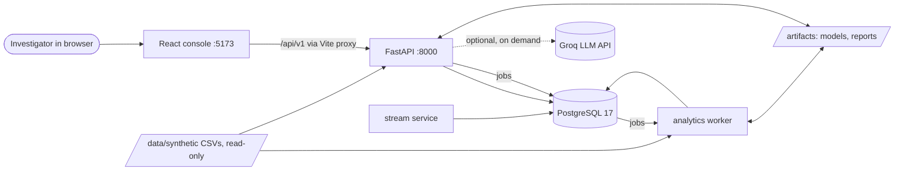
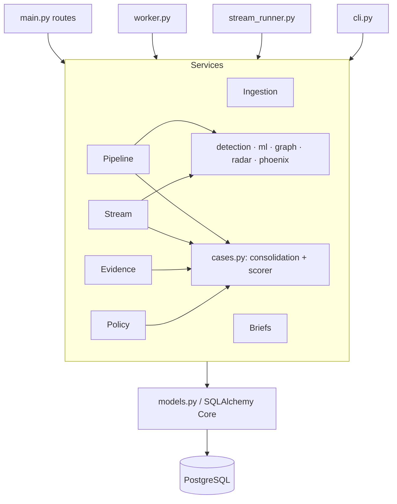
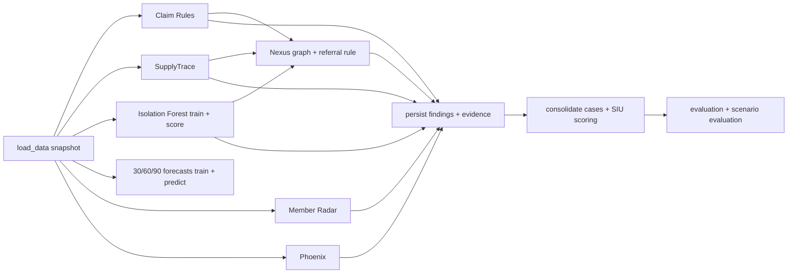
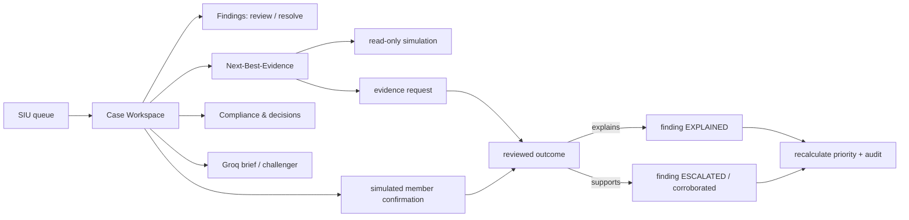
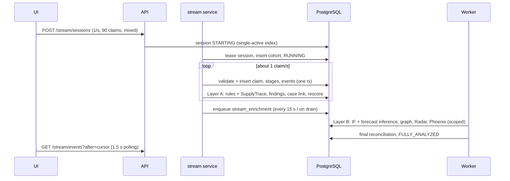

# ClaimShield Nexus — System Architecture

How the whole application is built: the deployment topology, every backend layer and analytical engine, the data model, processing flows, API surface, frontend, concurrency and reliability, trust boundaries, testing and known limits.

ClaimShield Nexus is a local, synthetic-data healthcare **payment-integrity investigation** platform. It ingests claims, runs deterministic, statistical, graph and behavioral detectors, consolidates their source-linked findings into ranked investigation cases, and supports human review. Its findings are screening indicators, never fraud determinations.

---

## 1. System context



**Everything runs locally under Docker Compose.** The only external call is optional: a Groq request when an investigator explicitly asks for a brief, challenger or investigator report. All patient, provider and claim records are synthetic.

---

## 2. Deployment topology

`docker-compose.yml` defines five services on one bridge network. Host ports bind only to loopback.

| Service | Image / command | Role | Host port |
|---|---|---|---|
| `db` | `postgres:17-alpine` | All persistent state: source tables, findings, cases, audit, jobs, stream, decisions. Volume `postgres_data`. | 127.0.0.1:55432 |
| `backend` | `./backend` → `alembic upgrade head && uvicorn app.main:app` | REST API, migrations at start, on-demand Groq calls | 127.0.0.1:8000 |
| `worker` | `./backend` → `python -m app.worker` | Persistent job queue: import, full analysis, model training, live-stream enrichment micro-batches | — |
| `stream` | `./backend` → `python -m app.stream_runner` | Live Claims Monitoring runner: synthetic claim generation and immediate screening. Idle until a session starts. | — |
| `frontend` | `./frontend` → `npm run build` then `vite preview` | Production React bundle; proxies `/api` and `/health` to `backend:8000` | 127.0.0.1:5173 |

**Startup order:**
- `db` must be healthy before `backend` starts.
- `backend` must be healthy before `worker`, `stream` and `frontend` start.

Every service has a healthcheck:
- **backend:** an HTTP check on `/health`.
- **worker** and **stream:** a heartbeat file each loop refreshes.
- **frontend:** an HTTP fetch of the page.

**Mounts:**
- `./data` is mounted **read-only**.
- `./artifacts` is mounted read-write. It holds the trained `joblib` models, evaluation reports, SupplyTrace comparisons, the scenario-pack snapshot and test outputs.

`backend`, `worker` and `stream` are built from the same `./backend` directory but are **separate images**. After backend code changes, rebuild all three: `docker compose build backend worker stream`.

---

## 3. Technology stack

| Layer | Technology |
|---|---|
| Backend | Python 3.12, FastAPI, Pydantic v2 / pydantic-settings, SQLAlchemy 2 Core, Alembic, psycopg 3 |
| Analytics | pandas, NumPy, SciPy, scikit-learn (IsolationForest, HistGradientBoosting, LogisticRegression), joblib, NetworkX |
| LLM | Groq SDK (structured JSON outputs), model `openai/gpt-oss-120b` by default |
| Database | PostgreSQL 17 (JSONB, advisory locks, `SKIP LOCKED`, partial unique index, trigger-enforced append-only audit) |
| Frontend | React 19, TypeScript, Vite 6, TanStack Query and Table, React Router 7, ECharts, Cytoscape.js, Lucide, React Hook Form and Zod, Tailwind v4 (button primitive), custom CSS theme |
| Tests | pytest (unit and PostgreSQL integration), Vitest with Testing Library (jsdom) |
| Runtime | Docker Compose; no message broker, no external database, no hosted model inference |

---

## 4. Backend structure

```
backend/
  alembic/versions/   0001 initial · 0002 investigation extensions · 0003 live monitoring · 0004 policy decisions
  app/
    core.py            settings (env), SQLAlchemy engine, clean() JSON serializer
    models.py          all tables (SQLAlchemy Core)
    schemas.py         Pydantic request/response contracts (Finding, Evidence, inputs)
    main.py            FastAPI app and all /api/v1 routes
    worker.py          leased job queue worker (import / analysis / stream_enrichment)
    stream_runner.py   live-stream runner process (generator + processor threads)
    cli.py             import · audit · analyze · train · all · augment · groq-check
    scenarios.py       scenario pack v1 builder (append-only synthetic scenarios)
    smoke.py           read-only live API smoke test
    stream_measure.py  measured live-stream run
    config/
      detectors.json         Member Radar and Phoenix thresholds and weights (versioned)
      evidence_catalog.json  Next-Best-Evidence catalog (versioned)
    services/
      ingestion.py        snapshot validation and transactional import; shared row checks
      repository.py       data loading, finding hydration, case detail read model
      detection.py        Claim Rules engine and SupplyTrace
      ml.py               Isolation Forest and 30/60/90 forecasts (training and inference)
      graph.py            Nexus graph build, referral rule, cached and incremental graph
      radar.py            Compromised Member ID Radar
      phoenix.py          Phoenix Provider Detector
      cases.py            case consolidation, SIU scorer, review actions, audit
      evidence.py         Next-Best-Evidence, evidence requests, member confirmations, spillover
      briefs.py           Groq briefs, challenger and investigator with local verification
      pipeline.py         full analysis orchestration and evaluation
      stream_generator.py live-stream scenario pack (deterministic)
      stream.py           stream sessions, Layer A/B processing, coverage, events
      policy.py           policy-governed decisions (CLAIMSHIELD-SIU-V1)
```

### Layering



- **One scorer, one finding contract.** Every path that creates findings (full analysis, live stream, reviews) uses the same `Finding`/`Evidence` contract and the same idempotent persistence (`pipeline.persist_findings`). Every path that ranks cases uses the same scorer (`cases.rank_values` via `recalculate`).
- **No ORM sessions.** SQLAlchemy Core with explicit transactions (`engine.begin()`).

---

## 5. Data model

All tables are defined in `app/models.py` and created by additive Alembic migrations. Downgrades are disabled to protect investigation records.

### 5.1 Source tables (12 required + 2 optional CSVs)

`members`, `facilities`, `providers`, `encounters`, `claims`, `claim_lines`, `supply_items`, `claim_estimates`, `referrals`, `relationships`, `investigation_history`, `billing_policies`, plus the optional `provider_profiles` and `member_profiles`. They are stored as follows:
- Columns are typed from the CSV headers: fixed-precision money, dates, timestamps (UTC), integers.
- Original IDs are the primary keys.
- Foreign keys are deferrable.
- Every row has `source_batch_id`, `source_file` and `created_at` (provenance).
- Monetary and quantity columns have non-negative check constraints.

`entities` is a typed registry of provider, facility, member, claim and owner IDs, used as graph endpoints and as finding and case entity references.

### 5.2 Analysis and investigation tables

| Table | Purpose |
|---|---|
| `analysis_batches` | Import, analysis and stream batches with status, checksum and report (JSONB) |
| `analysis_jobs` | Persistent job queue (kind, status, lease, attempts, progress, result) |
| `findings` | Screening findings: type, engine, entity, severity, score, version, explanation, completeness, limitations, **status** (ACTIVE / UNRESOLVED / ESCALATED / EXPLAINED) |
| `finding_claims` | Finding ↔ claim links |
| `finding_evidence` | Source-linked evidence records (observed value, reference context, provenance, verification status) |
| `model_versions` | Model cards: status (READY / INSUFFICIENT_DATA / FAILED), artifact path, metadata |
| `risk_predictions` | Isolation Forest scores (horizon 0) and 30/60/90 forecasts per provider |
| `cases`, `case_findings`, `case_entities` | Consolidated cases: status, severity, priority score, exposure, evidence strength, ranking factors, evidence version |
| `case_assignments`, `investigator_actions` | Reviewer actions |
| `audit_events` | **Append-only** (a database trigger rejects UPDATE/DELETE) case timeline |
| `investigation_briefs` | Cached Groq or deterministic reports, keyed by case, evidence version and kind |

### 5.3 Investigation extensions (migration 0002)

| Table | Purpose |
|---|---|
| `evidence_requests` | Next-Best-Evidence lifecycle: REQUESTED → RECEIVED → VERIFIED_EXPLAINS / VERIFIED_SUPPORTS / INCONCLUSIVE / WITHDRAWN |
| `member_confirmations` | Simulated member notices and responses (no one is contacted) |
| `member_risk` | Member Radar signal scores |
| `radar_batches`, `radar_batch_members` | Provider new-member batch candidates and their members |
| `provider_successors` | Phoenix predecessor → successor links, components and finding |

### 5.4 Live claims monitoring (migration 0003)

| Table | Purpose |
|---|---|
| `stream_sessions` | Config, seed, status, counters, runner lease, cohort. Partial unique index `uq_stream_one_active` allows only one active session. |
| `stream_claims` | Per streamed claim: session, sequence, scenario, generated/ingested times, analysis status, lease, run |
| `stream_claim_stages` | 12 coverage stages per claim with status, reason, error and result |
| `stream_events` | Ordered processing events (outbox) |
| `stream_enrichment_runs` | Micro-batch runs: covered claim IDs, watermark, engine results, timings |
| `stream_runners` | Runner heartbeats |

### 5.5 Policy decisions (migration 0004)

`policy_decisions`: case, action, policy version, evaluation, evidence references, justification, requester, approver, status (RECOMMENDED / PENDING_APPROVAL / APPROVED / REJECTED / BLOCKED).

### 5.6 Identity and idempotency conventions

- **Findings and evidence** have content-derived IDs: a SHA-256 hash of engine, type, entity and source record IDs. Re-running analysis inserts nothing new, and reviewer statuses are preserved (`on_conflict_do_nothing`).
- **Cases** use `CASE-` plus the hash of the first claim in the component. An existing case keeps its ID when its findings are re-consolidated.
- **Stream records** use session-scoped IDs (`SC{session}-{seq}`, cohort `PS{session}A/B/C`, `MS{session}nnn`), so replays never collide.

---

## 6. Ingestion

`services/ingestion.py`, from `cli import` or the *Data ingestion* page:

1. **Audit:**
   - The 12 required CSVs (and optional profiles) must have exact headers.
   - Values are type-checked, and duplicate primary keys and broken references are rejected.
   - Claim, supply and estimate rows go through the shared checks `claim_issues`, `supply_issues` and `estimate_issues`: date order, allowed ≤ billed, paid + member share ≤ allowed, line totals = billed, encounter consistency.
   - Any ERROR rejects the whole snapshot. WARNINGs are retained.
2. **Transactional import** under advisory lock `8231701`:
   - The checksum of the source files detects identical re-imports, which insert zero rows.
   - Existing IDs with different values raise a conflict (source records are immutable).
   - Only new IDs are inserted, and entities are registered.
3. The report is saved to `analysis_batches` and `artifacts/evaluation/latest_audit.json`.

The **scenario pack** (`cli augment`, seed 20261009) copies the original CSVs unchanged and appends scenario rows: P0251–P0264, profiles, claims, referrals and an acquisition record. It imports only the new IDs. Scenario labels go to a separate manifest that no detector reads.

---

## 7. Full analysis pipeline

`services/pipeline.analyze()`, run by `cli analyze` / `all` or a worker job:



### 7.1 Engines

| Engine | Module | What it detects | Notes |
|---|---|---|---|
| **Claim Rules** | `detection.rules` | Duplicate submissions, missing encounter, upcoding, unbundling, early refill, impossible (overlapping) appointments, excessive utilization | Policy-window gated by `billing_policies`. Utilization thresholds come from the procedure/complexity peer distribution (≥ 20 peers). |
| **SupplyTrace** | `detection.supply_analysis` | Consumable quantity and unit-price outliers, duplicate supply lines, estimate-to-final drift | Peers matched on procedure, complexity and supply code; median/IQR threshold `q3 + 3·max(IQR, 10% median)` |
| **Isolation Forest** | `ml.train_anomaly`, `ml.score_anomaly`, `ml.infer_anomaly` | Provider behavioral anomalies | As-of features (`feature_frame`), training before a chronological cutoff, scores reported as a percentile of training scores; a finding at ≥ 95th percentile |
| **Forecasts** | `ml.forecast_training`, `ml.infer_forecast` | 30/60/90-day recurrence of observable events | HistGradientBoosting with a logistic benchmark, chronological train/validation/test split with a 90-day embargo, model cards with PR-AUC, ROC-AUC, Brier score and calibration |
| **Nexus graph** | `graph.py` | Relationship graph; corroborated referral concentration | Requires independent findings at both endpoints; possible-successor edges labeled algorithmic |
| **Member Radar** | `radar.py` | Providers billing bursts of previously unrelated members; member risk signals | Robust median/MAD z-scores over five signals; batch checks: ≥ 25 new members, ≥ 5× growth, ≥ 80% unrelated, ≤ 20% care context |
| **Phoenix** | `phoenix.py` | Possible successors of suspended, revoked or closed providers | Five weighted components (patient overlap, shared identifiers, billing fingerprint, referral reuse, timing). The score is a similarity, not a probability. Predecessor allegations are never transferred. |

Model training failures are isolated: they are recorded as FAILED model cards, and rule-based analysis continues.

### 7.2 Case consolidation and SIU priority

`cases.consolidate` builds a graph over claim IDs. Findings sharing claims, provider-level findings about the same provider, and claims from the same provider and month are connected. Each connected component becomes one case, and an existing case keeps its ID. `cases.recalculate` scores each case with **`rank_values` (policy siu-1.0)**:

| Factor | Max | Basis |
|---|---|---|
| Severity | 30 | Highest active finding severity |
| Evidence | 20 | Mean data completeness of active findings |
| Exposure | 20 | log-scaled unique-claim exposure (paid amounts on paid claims, allowed amounts on pending claims) |
| Member impact | 10 | Distinct members, capped at 10 |
| Recurrence | 10 | 90-day forecast for the case's provider |
| Independent channels | 10 | Number of distinct engines |

Exposure deduplicates claims and is an upper bound for review, not a confirmed loss. Only ACTIVE, UNRESOLVED and ESCALATED findings count; EXPLAINED findings drop out.

### 7.3 Evaluation

`pipeline.evaluate` scores claim-level Precision@100 and Recall@100 baselines and capacity-ranking metrics against the separate `data/evaluation/ground_truth.csv`, used offline only. `scenario_evaluation` compares Radar and Phoenix output with the scenario manifest; live-stream cohorts are reported separately. Results are written to `artifacts/evaluation/*.json`.

---

## 8. Investigation workflows



- **Finding review** (`cases.resolve`): the investigator verifies specific evidence records and sets EXPLAINED, UNRESOLVED or ESCALATED. Every affected case is recalculated and its evidence version is bumped. An audited action is recorded.
- **Case actions** (`cases.apply_action`): status transitions follow a fixed state machine (NEW → QUEUED / UNDER_REVIEW → AWAITING_EVIDENCE / ESCALATED → RESOLVED → CLOSED). Assignments, notes and record requests are also supported.
- **Next-Best-Evidence** (`evidence.py`): for each active finding and catalog evidence type, the explains and supports outcomes are simulated with the **production scorer** (`case_inputs` + `apply_outcome` + `rank_values`). Each recommendation includes:
  - a decision-change probability
  - a capacity-boundary crossing flag
  - a decision value

  Simulations run in `SET TRANSACTION READ ONLY` transactions and cannot write. Probabilities are synthetic defaults until five or more reviewed outcomes exist; then Beta(1,1) smoothing is used.
- **Evidence lifecycle:**
  - A reviewed outcome becomes a new evidence record.
  - **VERIFIED_EXPLAINS** resolves the finding to EXPLAINED.
  - **VERIFIED_SUPPORTS** corroborates it: status ESCALATED and completeness 1.0. A member batch becomes HIGH severity after three distinct reviewed member denials.
- **Member confirmations:** deterministic notices built from stored claims, clearly simulated. Responses affect scoring only after investigator review.
- **Spillover:** other claims of batch members, grouped and shown as leads only, never added to exposure.
- **Groq reports** (`briefs.py`):
  - **Input:** compact local retrieval of at most about 12k characters of case evidence.
  - **Output:** strict JSON schema.
  - **Verification:** every fact must match an exact source field and value, every reference must belong to the case and finding, and numbers in the prose must exist in the evidence. Failing items are dropped and counted.
  - **Fallback:** a deterministic report when Groq is offline, fails, or nothing verifiable remains.
  - **Caching:** only successful Groq results are cached, by case and evidence version.
  - The LLM has no tools and cannot change state.

---

## 9. Live Claims Monitoring

Two processing layers turn a synthetic claim stream into fully analyzed claims (details: `docs/LIVE_CLAIMS_MONITORING.md`).



- **Layer A** (immediate, per claim, `stream` service):
  - validation with the importer's row checks
  - transactional persistence with an exactly-once counter
  - existing `rules()` and `supply_analysis()` on scoped record sets
  - finding persistence, then `cases.link_incremental` and rescoring
- **Layer B** (micro-batch, existing worker): inference with stored models (no retraining), plus graph, Radar and Phoenix scoped to the affected providers and members. Each run records exactly which claims it covered.
- **Coverage:** each claim tracks 12 stages. **Fully analyzed** means every stage is COMPLETED, NOT_APPLICABLE or INSUFFICIENT_DATA; FAILED or pending stages never count.
- **Events:** an outbox written in the same transaction as the state change, under advisory lock `8231710`, so event IDs become visible in commit order. Delivered by cursor polling, with an SSE endpoint also available.
- **Isolation:** each session uses its own synthetic provider and member cohort, and service dates replay September 2026.
- **Reliability:** leases, retries (3 attempts), drain-on-stop and backpressure (pause at ≥ 20 claims awaiting screening). Measured: 60/60 fully analyzed, end-to-end p95 18 s.

---

## 10. Policy-governed decisions

`services/policy.py` implements the internal demo policy **CLAIMSHIELD-SIU-V1** (details: `docs/POLICY_DECISIONS.md`).

- **Pure evaluator:** `evaluate(case, findings, evidence requests, recorded decisions)`. It never takes the priority score as input.
- **Actions:** Request more evidence, Monitor provider, Recommend full investigation (needs an active finding with investigator-reviewed support), and Recommend external referral (never Allowed; it needs an active investigation, two or more reviewed supporting records, mandatory evidence types, a justification and supervisor approval).
- **Explained findings never justify escalation.**
- **Server-side enforcement:** submissions are re-evaluated on the server and stored as RECOMMENDED, PENDING_APPROVAL or BLOCKED, with two audit events each.
- **Approvals:** there is no authentication, so approve and reject endpoints refuse with 403. A typed name is never trusted, and self-approval is refused.
- **Decision readiness:** derived from the evaluation and shown in the SIU queue, independent of ranking.

---

## 11. API surface (`/api/v1`, plus `/health`)

| Area | Routes |
|---|---|
| Dataset and jobs | `GET /dataset/summary`, `GET /dataset/audit`, `GET /batches`, `GET /batches/{id}`, `POST /batches/upload`, `POST /analysis/run`, `GET /analysis/jobs`, `GET /analysis/jobs/{id}` |
| Claims and providers | `GET /claims`, `GET /claims/{id}`, `GET /claims/{id}/supplytrace`, `GET /providers`, `GET /providers/{id}`, `GET /providers/{id}/anomalies`, `GET /providers/{id}/forecast` |
| Network | `GET /network/{entity}` (bounded neighborhood, filters, as-of date) |
| Cases and queue | `GET /cases`, `GET /siu/queue` (with `decision_readiness`), `GET /cases/{id}`, `/evidence`, `/timeline`, `POST /cases/{id}/actions`, `POST /findings/{id}/resolve` |
| Groq | `POST /cases/{id}/brief`, `/challenge`, `/investigate` |
| Models | `GET /models/status`, `GET /evaluation/summary` |
| Next-Best-Evidence | `GET /cases/{id}/next-evidence`, `GET /siu/queue/next-evidence`, `POST /cases/{id}/simulate` (read-only), `GET/POST /cases/{id}/evidence-requests`, `POST /evidence-requests/{id}/outcome` |
| Confirmations and spillover | `GET/POST /cases/{id}/confirmations`, `POST /confirmations/{id}/response`, `GET /cases/{id}/spillover` |
| Member Radar | `GET /radar/batches`, `/radar/batches/{provider}`, `/members`, `/graph`, `GET /radar/members`, `GET /members/{id}/risk` |
| Phoenix | `GET /phoenix/links`, `/phoenix/links/{id}`, `GET /providers/{id}/successors`, `/predecessors` |
| Live stream | `GET /stream`, `GET/POST /stream/sessions`, `POST /stream/sessions/{id}/stop`, `GET /stream/sessions/{id}`, `/summary`, `/claims`, `GET /stream/claims/{id}/coverage`, `POST /stream/claims/{id}/retry`, `GET /stream/events`, `GET /stream/events/subscribe` (SSE) |
| Policy | `GET /cases/{id}/policy`, `POST /cases/{id}/decisions`, `POST /decisions/{id}/approve`, `/reject` |

Error mapping: 404 not found, 409 conflicting state, 422 validation, 403 approval refused, 503 stream runner offline. OpenAPI docs are at `http://localhost:8000/docs`.

---

## 12. Frontend architecture

```
frontend/src/
  main.tsx           QueryClient (staleTime 10 s), BrowserRouter, styles.css + theme.css
  App.tsx            shell: sidebar (brand, global search with "/" shortcut, grouped nav, user card), routes, <StreamSync/>
  api.ts             fetch wrapper (GET/POST JSON, error detail), useApi (TanStack Query keyed by path), formatters
  types.ts           shared TypeScript contracts
  components/common.tsx  State (loading/error/empty), Card, Table (TanStack Table), Pager, Badge, Chart (ECharts), Fields, Notice
  components/ui/button.tsx  CVA button variants
  pages/
    System.tsx        Overview (dashboard), Ingestion, Evaluation, PageTitle
    LiveMonitor.tsx   Live Claims Monitor (collapsible), event feed, claim pipeline inspector, StreamSync
    Claims.tsx        Claims explorer, Claim detail / SupplyTrace detail, FindingCard
    Cases.tsx         SIU queue (with decision readiness), Case Workspace (tabs, review form, actions, brief)
    Investigation.tsx Next-Best-Evidence, requests, confirmations, spillover, Phoenix case panel, grouped findings
    Compliance.tsx    Compliance & decisions tab, Readiness badge
    Intelligence.tsx  Nexus network (Cytoscape), Phoenix breakdown, successor banner, Future risk
    Radar.tsx         Member Radar list, batch detail, member inspector
  theme.css          light workspace theme (overrides styles.css)
```

| Route | Screen |
|---|---|
| `/` | Dashboard: stats, Live Claims Monitor, claims activity, case severity, top investigations, system status |
| `/queue` | Smart SIU queue |
| `/cases/:id` | Case Workspace |
| `/claims`, `/claims/:id` | Claims explorer and detail |
| `/supplytrace`, `/supplytrace/:id` | SupplyTrace |
| `/network?entity=` | Nexus network |
| `/radar`, `/radar/:provider` | Member Radar |
| `/forecast?provider=` | Future risk |
| `/ingestion` | Data ingestion |
| `/evaluation` | Models & evaluation |

- **State:** server state lives only in TanStack Query. Query keys are API paths, which allows prefix-based invalidation.
- **Live updates:** `StreamSync` polls `/stream` and invalidates only the affected query prefixes when counters change. Graphs refresh once per micro-batch, not per claim.
- **Live feed:** `useEventFeed` does cursor polling with one request at a time, increasing IDs, de-duplication and at most 300 kept events.
- **Contract:** the UI never reads CSVs or model files; everything comes through the API.

---

## 13. Concurrency and reliability

| Mechanism | Where |
|---|---|
| Advisory lock `8231701` | Imports are serialized |
| Advisory lock `8231702` | Finding and case writes (full analysis, Layer A, Layer B) are serialized |
| Advisory lock `8231703` | Job enqueue de-duplication (dataset jobs exclusive; one stream enrichment at a time) |
| Advisory lock `8231710` | Stream events are committed in ID order |
| Advisory lock `8231711` | Stream session start |
| `FOR UPDATE SKIP LOCKED` and leases | Worker jobs (90 s lease, heartbeat 10 s, 3 attempts); stream claim processing (60 s lease); stream session ownership (30 s lease) |
| Partial unique index | At most one active stream session |
| Idempotent IDs and `on_conflict_do_nothing` | Re-runs and retries never duplicate findings, evidence or case links |
| Read-only transactions | Next-Best-Evidence simulations and policy reads cannot write |
| Append-only trigger | `audit_events` cannot be updated or deleted by the application |

---

## 14. Trust boundaries and security

| Boundary | Rule |
|---|---|
| **Identity** | A labeled demo identity, not authentication. Anyone with local API access can act as a reviewer, which is why approvals are disabled. |
| **Network** | Host ports bind to loopback only. CORS allows only the local UI origin. |
| **Secrets** | `GROQ_API_KEY` comes from the environment and `.env`, which is gitignored. It is never returned by the API or sent to the frontend. |
| **LLM** | Receives only a bounded synthetic evidence snapshot. Output is verified locally and cannot change state. |
| **Artifacts** | `joblib` models are trusted local files; never load untrusted pickles. |
| **Data** | All records are synthetic. Findings are indicators for human review; exposure is an upper bound. |

---

## 15. Configuration

| Variable | Default | Purpose |
|---|---|---|
| `POSTGRES_PASSWORD` | `claimshield_local_demo` | Database password |
| `GROQ_API_KEY` / `GROQ_MODEL` / `GROQ_TIMEOUT_SECONDS` | empty / `openai/gpt-oss-120b` / 45 | Optional LLM |
| `STREAM_DEFAULT_RATE` / `STREAM_DEFAULT_COUNT` | 1 / 60 (the UI starts 90) | Live stream defaults |
| `STREAM_ENRICHMENT_INTERVAL_SECONDS` | 15 | Micro-batch interval |
| `STREAM_MAX_BACKLOG` | 20 | Backpressure threshold |

Versioned configuration and policies:
- `config/detectors.json` (`member-radar-1.0`, `phoenix-1.0`)
- `config/evidence_catalog.json` (`evidence-catalog-1.0`)
- the SIU scorer (`siu-1.0`)
- the decision policy (`CLAIMSHIELD-SIU-V1`)
- the stream pack (`live-stream-pack-v1`)

---

## 16. Testing architecture

| Suite | Database | Scope |
|---|---|---|
| Backend unit (`tests/test_*.py`) | `claimshield_test` | Ingestion, rules, SupplyTrace, graph, ML, briefs, features, stream generator, policy rules, plus the original end-to-end review workflow |
| Feature, policy and stream integration (`test_features_integration.py`, `test_policy_integration.py`, `test_stream_integration.py`) | Disposable `claimshield_features_test`, recreated each run | Scenario pack, Next-Best-Evidence, confirmations, Phoenix; policy decisions on P0252/P0258; full live-stream sessions |
| Frontend (Vitest, `src/*.test.tsx`) | Mocked fetch | Dashboard, queue, case workspace, review form, network, radar, Next-Best-Evidence, live monitor, compliance |
| Live smoke (`app.smoke`) | Demo database, read-only | Running API routes |

`scripts/test.ps1` runs all of them and never touches the demo database `claimshield`.

---

## 17. Known limitations

- **No authentication or roles:** approvals are therefore disabled.
- **Single-node snapshot analytics:** sized for about 20k claims; full analysis reloads the whole dataset.
- **Hand-chosen heuristics:** detector thresholds, scoring weights and policy rules were set by hand on synthetic data and are not validated on real claims.
- **Cold-start anomalies:** Isolation Forest flags brand-new providers whose volume ramps from zero.
- **Synthetic geography:** it does not separate providers, so it is shown but not required in Member Radar.
- **Replay stream:** service dates replay a past window; it is not a prospective real-time feed.
- **Audit immutability:** enforced against the application, not against a database administrator.
